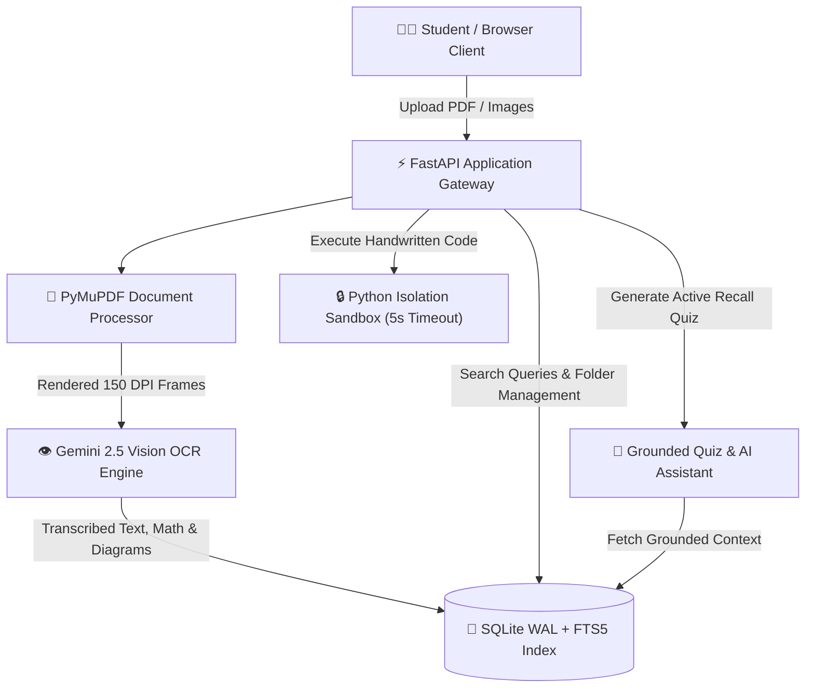

# 📓 Notebook Intelligence System (NIS)

[](https://notebook-intelligence.vercel.app)
[](https://python.org)
[](https://fastapi.tiangolo.com)
[](https://aistudio.google.com)
[](LICENSE)

> **Notebook Intelligence System** is an educational platform that digitizes handwritten lecture notes and diagrams, provides sub-millisecond full-text search with highlighting, synthesizes grounded explanations with exact page citations, builds active recall quizzes scoped by folder, and reviews & executes extracted code in a secure sandbox.

🌐 **Live Production App:** [https://notebook-intelligence.vercel.app](https://notebook-intelligence.vercel.app)

---

## ✨ Key Features

| Feature | Description |
| :--- | :--- |
| 👁️ **Multimodal OCR & Vision** | High-resolution PDF rendering (150 DPI via `PyMuPDF`) and image transcription using **Google Gemini 2.5 Flash**. Transcribes messy handwriting, mathematical formulas, and flowcharts. |
| 📊 **Diagram & Formula Parsing** | Detects flowchart architectures, converting handwritten diagrams into interactive **Mermaid.js** diagrams and mathematical expressions into formatted **KaTeX / LaTeX**. |
| 🔍 **Full-Text Search (FTS5)** | Sub-millisecond indexed search across all digitized transcripts with real-time term highlighting and context snippets. |
| 📁 **Folders & Collections** | Organize lecture scans into customizable course collections. Move notes seamlessly, export whole collections into a **collective PDF book**, and benefit from folder-level deletion protection. |
| 📖 **Interactive Notebook Viewer** | Side-by-side original scans and editable transcripts. Re-run OCR on individual pages, edit corrections, and view block metadata. |
| 🎯 **Active Recall Quiz Portal** | Generate grounded multiple-choice quizzes (SRS Section 6.3 standard) filtered by **Folder**, **Source Document**, **Page Range**, and **Difficulty level** with instant answer grading and explanations. |
| 💬 **Grounded AI Assistant** | Ask natural-language questions about lecture notes with guaranteed grounding strictly in notebook content, with clickable page source citations. |
| 💻 **Python Sandbox & Code Lab** | Extracts handwritten Python snippets into a dedicated code editor with quick-clear functionality, executing isolated subprocesses (`python -I`) with strict timeout (5s) and network guardrails. |
| 🔐 **Multi-Tenant User Isolation** | Built-in authentication (Supabase Auth & fallback JWT session security) providing isolated storage and private notebook workspaces for every student. |

---

## 🏗️ System Architecture



---

## ⚡ Quick Start (Local Setup)

### 1. Prerequisites
- **Python 3.10+** (Python 3.10 – 3.13 supported)
- **Git**

### 2. Clone & Setup

#### Windows:
```cmd
git clone https://github.com/Asmi4565/Notebook_intelligence.git
cd Notebook_intelligence
setup.bat
run.bat
```

#### macOS / Linux:
```bash
git clone https://github.com/Asmi4565/Notebook_intelligence.git
cd Notebook_intelligence
chmod +x setup.sh run.sh
./setup.sh
./run.sh
```

Open your browser at **`http://localhost:8000`**.

---

## 🔑 Environment Configuration

Create a `.env` file in the root directory (or copy from `.env.example`):

```env
# Gemini API Key (Required for online OCR & AI Assistant)
GEMINI_API_KEY=your_gemini_api_key_here
GEMINI_MODEL=gemini-2.5-flash

# Authentication & Security (Optional for Supabase Cloud Auth)
SUPABASE_URL=https://your-project.supabase.co
SUPABASE_ANON_KEY=your_supabase_anon_key_here
JWT_SECRET=your_jwt_secret_key_here

# Sandbox Configuration
DISABLE_CODE_LAB=false
```

> 💡 **Offline Demo Mode:** If no `GEMINI_API_KEY` is provided, NIS automatically boots in simulated offline mode using realistic academic note fixtures, enabling testing of all search, quiz, viewer, and folder capabilities without an API key!

---

## 📁 Repository Structure

```
Notebook_intelligence/
├── app.py                   # FastAPI Gateway, REST endpoints, and router
├── db.py                    # SQLite Layer (WAL Mode, FTS5 Search, User Isolation)
├── document_processor.py    # PyMuPDF rendering & multi-page PDF decomposition
├── ocr_engine.py            # Gemini 2.5 Flash Vision OCR & block parser
├── ai_assistant.py          # Grounded quiz generator & question-answering
├── code_sandbox.py          # Isolated subprocess Python code executor
├── search_indexer.py        # In-memory inverted indexer & snippet highlighter
├── frontend/                # Client web application
│   ├── index.html           # Single-page interface & tabbed workspaces
│   ├── css/style.css        # Responsive glassmorphism styling & tokens
│   └── js/app.js            # Client state, folder synchronization & API bridge
├── tests/                   # Automated Pytest validation test suites
│   ├── test_db.py           # Database CRUD, cascade, & search tests
│   ├── test_suite.py        # End-to-end integration test suite
│   ├── test_folder_quiz.py  # Folder-scoped quiz generation tests
│   └── test_scan_persistence.py # Multi-user isolation & session persistence
├── vercel.json              # Serverless configuration for Vercel deployment
├── requirements.txt         # Pinned Python package dependencies
├── setup.bat / setup.sh     # Automated environment installation scripts
└── run.bat / run.sh         # One-click application launchers
```

---

## 🧪 Testing & Verification

The project includes automated integration and unit test coverage across all subsystems:

```bash
# Run the entire test suite (39 tests)
python -m pytest test_suite.py tests/test_db.py test_scan_persistence.py tests/test_folder_quiz.py -v
```

---

## 🏥 Health Check Endpoint

Check server, database connection, and API status via the `/health` endpoint:

```http
GET /health
```

Example JSON response:
```json
{
  "status": "healthy",
  "database_connected": true,
  "api_key_configured": true,
  "disable_code_lab": false
}
```

---

## 📄 License

This project is licensed under the [MIT License](LICENSE).
